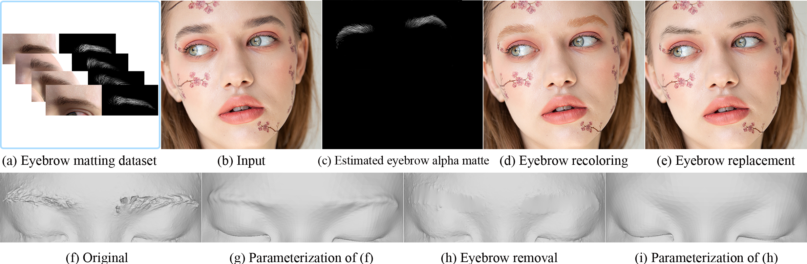

# Effective Eyebrow Matting with Domain Adaptation - Official Pytorch Implementation

The source code and dataset of "Effective Eyebrow Matting with Domain Adaptation" which will appear in Pacific Graphics 2022 conference.

<p align="center">
  
</p>

## Requirements
Linux and Windows are both supported, but we recommend Linux for performance reason.
- torch >= 1.11.0
- 64-bit python 3.8
- tensorboardX
- numpy
- opencv-python
- toml
- easydict
- pprint

## Dataset
 Path | Description
| :--- | :----------
| [DAM-Net-eyebrow-matting-dataset](https://drive.google.com/file/d/1i-pg3sdssNPeVpRU-QO4I1dTAFcClZAg/view?usp=sharing) | Main directory of the dataset
| &ensp;&ensp;&boxvr;&nbsp; annotated-dataset | Manually annotated test eyebrow matting dataset containing various eyebrow images
| &ensp;&ensp;&ensp;&ensp;&boxvr;&nbsp; image | 68 original real-world eyebrow images
| &ensp;&ensp;&ensp;&ensp;&boxvr;&nbsp; mask | 68 manually annotated corresponding eyebrow mattes
| &ensp;&ensp;&ensp;&ensp;&boxvr;&nbsp; trimap | Full gray trimap inputs for inference
| &ensp;&ensp;&ensp;&ensp;&boxvr;&nbsp; trimap2 | Trimap inputs for comparison methods [[Sun et al.]](https://ieeexplore.ieee.org/document/9578347) [[Li and Lu]](https://ojs.aaai.org//index.php/AAAI/article/view/6809)
| &ensp;&ensp;&boxvr;&nbsp; real | 1,215 unlabeled real-world eyebrow images
| &ensp;&ensp;&boxvr;&nbsp; synthetic-dataset | Synthetic eyebrow matting dataset
| &ensp;&ensp;&ensp;&ensp;&boxvr;&nbsp; test | 200 synthetic eyebrow matting data for inference
| &ensp;&ensp;&ensp;&ensp;&ensp;&ensp;&boxvr;&nbsp; image | 200 rendered eyebrow images
| &ensp;&ensp;&ensp;&ensp;&ensp;&ensp;&boxvr;&nbsp; mask | 200 corresponding eyebrow mattes
| &ensp;&ensp;&ensp;&ensp;&ensp;&ensp;&boxvr;&nbsp; trimap | Full gray trimap inputs for inference
| &ensp;&ensp;&ensp;&ensp;&ensp;&ensp;&boxvr;&nbsp; trimap2 | Trimap inputs for comparison methods [[Sun et al.]](https://ieeexplore.ieee.org/document/9578347) [[Li and Lu]](https://ojs.aaai.org//index.php/AAAI/article/view/6809)
| &ensp;&ensp;&ensp;&ensp;&boxvr;&nbsp; train | 800 synthetic eyebrow matting data for training
| &ensp;&ensp;&ensp;&ensp;&ensp;&ensp;&boxvr;&nbsp; image | 800 rendered eyebrow images
| &ensp;&ensp;&ensp;&ensp;&ensp;&ensp;&boxvr;&nbsp; mask | 800 corresponding eyebrow mattes

## Models

We trained our network in a semi-supervised manner and can learn domain-invariant mid-level alpha features from the synthetic eyebrow matting dataset and unlabeled real-world images based on adversarial learning.

 Path | Description
| :--- | :----------
| [checkpoints](https://drive.google.com/file/d/1V_aCPJaDlKqymTAqa251rUIF1h4Y5OPD/view?usp=sharing) | Main directory of the pretrained models.
| &ensp;&ensp;&boxvr;&nbsp; Baseline | Main directory of the Baseline model.
| &ensp;&ensp;&ensp;&ensp;&boxvr;&nbsp; best_model.pth | Baseline model trained with our synthetic matting dataset. Save to `./pretrain/Baseline/`.
| &ensp;&ensp;&boxvr;&nbsp; DAM-Net | Main directory of the DAM-Net model.
| &ensp;&ensp;&ensp;&ensp;&boxvr;&nbsp; best_model.pth | DAM-Net model trained with our synthetic matting dataset and unlabeled real-world images. Save to `./pretrain/DAM-Net/`.
| [ResNet34_En_nomixup](https://drive.google.com/open?id=1kNj33D7x7tR-5hXOvxO53QeCEC8ih3-A) | Model of the customized ResNet-34 backbone trained on ImageNet. Save to `./pretrain/`.


## Data Preparation
For inference, full gray trimaps of the same size as the inputs is required. Eyebrow images of any size can be used.

## Configuration
TOML files are used as configurations in `./config/`. You can find the definition and options in `./utils/config.py`.

## Training
Our source code is based on [GCA](https://github.com/Yaoyi-Li/GCA-Matting). We train the network on a Windows desktop PC with a single NVIDIA GTX 2080 (8GB memory), Intel Xeon W-2123 3.60 GHz CPU, and 32GB RAM.

First, you need to set your training and validation data path in DAM-Net.toml:
```toml
[data]
train_fg = ""
train_alpha = ""
train_bg = ""
pupil_bg = ""
real_image = ""
test_merged = ""
test_alpha = ""
test_trimap = ""
```
Then, you can train the model by 
```bash
python -u eyebrow_train.py --config=config/DAM_Net.toml
```

## Inference
You can run the inference using the command:
```bash
sh ./test.sh your_test_image_path DAM-Net
```